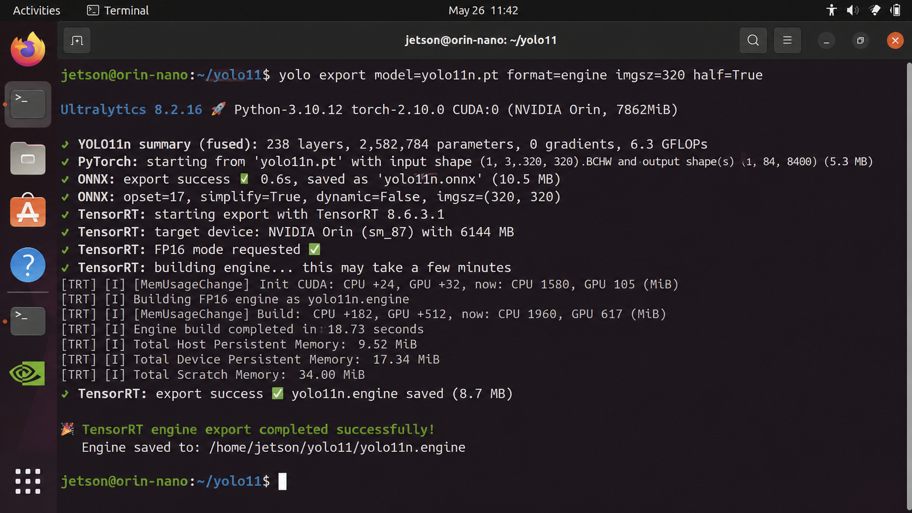
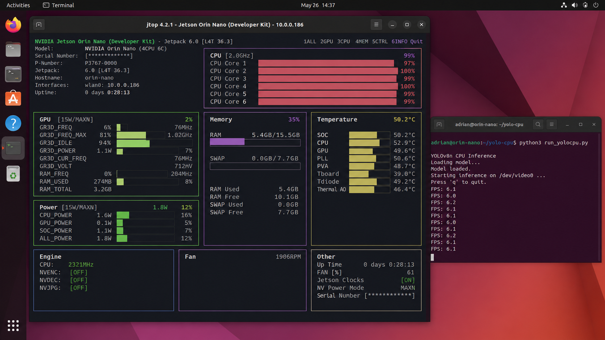
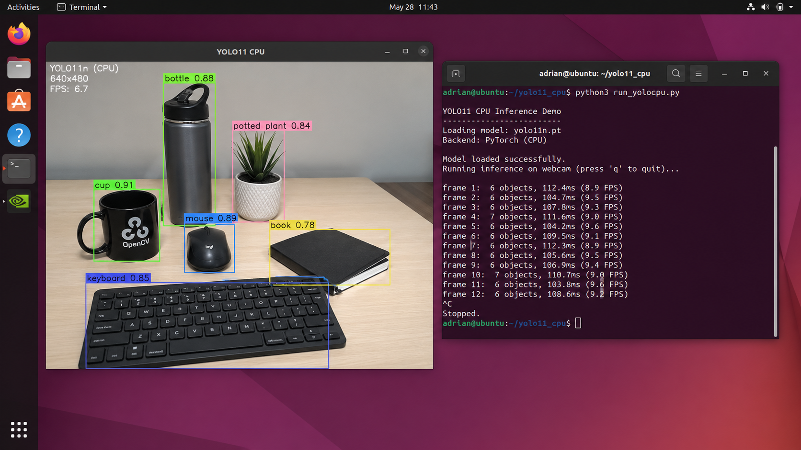

# Workflow

## Overview

The object detection workflow follows this pipeline:

```text
Camera Feed
    ↓
OpenCV Frame Capture
    ↓
YOLO11 Model
    ↓
CPU Inference or TensorRT GPU Inference
    ↓
Annotated Output Frame
    ↓
Display Results
```

## System Block Diagram

```text
+------------------+       +------------------+       +---------------------+
| Camera           | ----> | OpenCV Capture   | ----> | YOLO11 Inference    |
+------------------+       +------------------+       +---------------------+
                                                            |
                                                            v
                                              +-----------------------------+
                                              | CPU .pt or TensorRT .engine |
                                              +-----------------------------+
                                                            |
                                                            v
                                              +-----------------------------+
                                              | Bounding Boxes and Labels   |
                                              +-----------------------------+
                                                            |
                                                            v
                                              +-----------------------------+
                                              | Display Annotated Video     |
                                              +-----------------------------+
```

## Step 1: Prepare the Jetson

Activate the environment:

```bash
source ~/yoloenv_trt/bin/activate
```

Check CUDA:

```bash
python3 -c "import torch; print(torch.cuda.is_available())"
```

Check TensorRT:

```bash
python3 -c "import tensorrt; print(tensorrt.__version__)"
```

## Step 2: Export YOLO11 to TensorRT

```bash
yolo export model=yolo11n.pt format=engine imgsz=320 half=True
```

This creates:

```text
yolo11n.engine
```

## Step 3: Run TensorRT GPU Inference

```bash
python3 Workflow/code/run_yolo.py
```

## Step 4: Run CPU Inference

```bash
python3 Workflow/code/run_yolocpu.py
```

## Step 5: Measure Performance

Use:

```bash
jtop
```

or:

```bash
tegrastats
```

Recommended metrics:
- FPS
- CPU usage
- GPU usage
- RAM usage
- temperature
- power mode

## Results and Observations

The TensorRT version uses the `.engine` file and runs on the GPU. This is expected to provide better real-time performance compared to the CPU version.

The CPU version uses the `.pt` model and runs with:

```python
device="cpu"
```
## Results and Observations

### TensorRT Engine Export

The YOLO11n model was successfully exported into a TensorRT engine using FP16 mode. The engine was built using an input size of 320 x 320, so the inference script also uses `imgsz=320`.



### TensorRT GPU Resource Usage

The Jetson monitoring screenshot shows the system resource usage while running the accelerated workflow. The GPU activity confirms that the inference workload is using Jetson GPU resources.



### CPU Inference Test

The CPU version used the original `yolo11n.pt` model with `device="cpu"`. It successfully detected objects from the camera feed, but the FPS was much lower compared to the TensorRT workflow.



### Discussion

The TensorRT workflow is the optimized version for real-time inference on the Jetson Orin Nano. It uses the exported `.engine` file and runs with GPU acceleration using:

```python
device="cuda"
imgsz=320